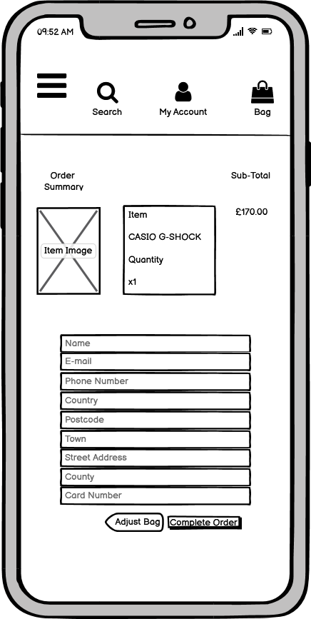
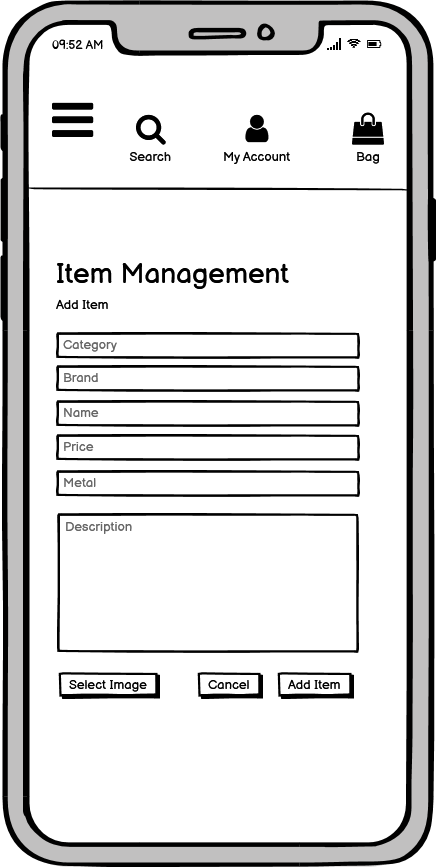
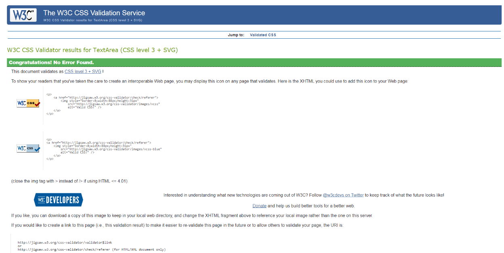

# Lusso Jewellery Store

This project is designed to be a website targeted at males who want to improve their style with either watches or chains. The website will allow users to be able to view a wide selection of watches/chains and give them the ability to buy the items on view. 

Access to the website can be found [HERE](https://lusso-jewels.herokuapp.com/) 

The goals of the website are as follows: 

* To provide a visually appealing website. 

* To provide a simplistic process for the site owner to add and take away items they would like to sell. 

* To showcase the site owner’s products to a good standard through product images and descriptions. 

* To supply users with an easy payment process. 

* To supply users with order confirmation emails once the have made a payment to the website. 

* To give users the option to register with the site and be provided with their order history. 

## UX 

### Ideal Consumer 

This website is aimed at users who: 

* Are seeking watches or chains to purchase for themselves or as gifts. 

* Want to keep up with the latest watches and chains. 

* Are willing to become regular consumers. 

Visitors to the website will be looking for: 

* The latest range of jewellery with frequent updates to the shop’s range. 

* Detailed information on the products they are interested in purchasing. 

* A safe and secure payment method for them to purchase products. 

* The option to register an account with the website to keep up to date on their order history. 

* Verification of their purchase 

* A smooth, simple pathway to make view products and make purchases. 

This project helps the consumer achieve this by: 

* The ability for the site owner to update his range of products with a simple process. 

* Providing users with a visually appealing design. 

* The use of the payment platform ‘Stripe’ which takes care of a safe and secure payment process. 

* Providing product images and descriptions for each product. 

* Sending consumers confirmation emails after their purchase. 

The following images are wireframes from each page of the website: 

[HERE] 

## Client Stories 

* As a first time visitor I want to know exactly what the website is trying to sell me, with quick pathways to the products they are selling. 

* As somebody who is always intrigued by the latest releases from my favourite brands I would like a website that stays up to date. 

* As a regular and frequent purchaser of these particular products I want the payment process to be a fluid process whilst maintaining proper safety standards.

* As someone that is particular interested in specific brands, I want to be able to easily filter through the brands I enjoy the most.  

## Features 

### Home 

The home page contains a vibrant background image of a pristine Rolex watch which intends to inform users that the business aims to provide high end luxury products.  

Two buttons are provided in a very structured format so users can easily navigate to either the watch or chain section of the website. Although that option is provided to the user in the navigation bar with “All Watches” and “All Chains” already, the two buttons provide a faster and more direct route to these pages.  

The navigation bar offers a fluid, hover underline effect and also provides visitors with a direct pathway to the products. There is also a crown icon used from “font-awesome” so that users can easily redirect back to the homepage whenever they wish. 

The website uses the two fonts “EB Garamond” and “Playfair Display”. These fonts were chosen as they present a classy theme to the website which interlinks with the website’s business aim of selling luxury products.  

The website also offers search functionality for users to instantly search for a term to find the item they desire. 

### All Items 

The ‘All Items’ section of the website houses all the items listed within the store. The page houses a sort box which offers filtering options: ‘Price’, ‘Brand’, and ‘Name’.  

Items are displayed in a structured format with four items being displayed in each row, with a horizontal rule underneath to separate from other items. Each items image includes basic item information such as their name, price and brand. The display translates well into smaller screen sizes as good spacing is maintained.  

This section was made for users who do not have a specific item in mind and would just like to browse through the store. There is also a back to the top button which allows users to return to the top of the page should they lose their way through the variety of items. 

### Watches and Chains 

The ‘Watches’ and ‘Chains’ section maintains the display structure of the ‘All Items’ section, but also offer a redirection link to the ‘All Items’ page. These pages also offer neat buttons which separate the items into either brands (for Watches) and metals (for Chains).  

### Item Description 

When users click on an item they will be sent to a page which offers a bigger image of the item along with a more detailed description of the item. 

This page gives users the option to make an order for a specific item by giving them a quantity selection button, along with either the ‘Keep Shopping’ or ‘Add to Bag’ buttons. 

Should users click ‘Keep Shopping’ they will be redirected to the items page. Should the user click ‘Add to Bag’, they will receive a confirmation toast which includes item details and an option to go to the checkout page to complete their order. The bag icon in the top right of the screen will also be updated to show the total cost of their order.  

### Bag 

The shopping bag page offers users the ability to update their order by either changing the quantity or removing the item. It also displays product information such as name and price with the order’s grand total. If user’s are satisfied with their order they can click on the ‘Secure Checkout’ button to complete their order. 

### Checkout 

The checkout page includes a form for users to fill out containing their personal, delivery and payment information as well as buttons for users to either adjust their bag or to finalise their order.  

### Checkout Success 

Once users have completed their order, they will be redirected to the ‘Checkout Success’ page where they will also be greeted with a success toast ensuring them that they will be sent a confirmation email as well as their personal order number. 

Also on the checkout success page is the user’s order information, allowing users to make sure they have entered their order details correctly. 

### Register 

The ‘Register’ page contains a sign up form for users to create an account with. This includes mandatory safety checks which make sure the user creates a suitable password. 

Upon successfully creating a suitable account, users will be redirected to an e-mail verification page where users will be prompted to verify their e-mail address, accompanied with an alert toast. 

### Login 

The ‘Login’ page contains a form for registered users to enter their account information to sign in with. For those that do not have an account registered yet, there is an redirect option for users to create an account.  

For registered users who have forgotten their password, there is a button which directs users to the password reset page where they can enter their e-mail address to reset their password. 

### Product Management 

The Product Management page allows the site owner to add new items to the store, by filling out the form. This form includes the item category, name of the product, brand, price, item image and item description. Upon the completion of this form the item will be categorised in either the watches or chains section of the website and be available for purchase.  

### My Profile 

The ‘My Profile’ page contains a registered user’s delivery information which they are able to make changes to, as well as an order history section which gives them proof of their past purchases. 

### Edit Item

The ‘Edit Item' page allows the site owner to access existing items and make the appropriate changes to them.

## Features to Implement in the future 

* As a jewellery store there would need to be a greater variation of products such as rings, earrings etc. 

* In such a competitive industry the business would need to offer greater discounts and deals, so implementing a ‘deals’ section would be a viable addition in the future. 

## Technologies Used 

* HTML, CSS, Javascript and Python programming languages 

* GitHUB – Used as an IDE by the developer. 

* Google Fonts – Used to style the website fonts. 

* Hover.css – Used for an underlining feature in the navigation bar for whenever a user hovers over a page link. 

* Popper.js – Used to reference JavaScript. 

* FontAwesome - Used icons for the arrows, account page and crown icon in the navigation bar.  

* Django – Used to rapidly create a secure and maintainable website. 

* All images imported were downloaded from Google Images and then stored and linked by the developer. 

* BootstrapCDN - Bootstrap 5 was used for the project’s structure and responsiveness. 

* Balsamiq – Used to create wireframes for the website. 

## Testing 

- HTML Code Validator

- W3C CSS Code Validation

CSS Check for the base css.

CSS Check for the profile page's css.

CSS Check of the Checkout page's css. 

## Client Stories Testing 

1. As a first time visitor I want to know exactly what the website is trying to sell me, with quick pathways to the products they are selling. 

i. The homepage offers the user two bold buttons with a direct link to both the 'Watches' and 'Chains' page, as well as a clear navigation bar routing users
to all of the website's products. 

ii. Due to the business' name 'Lusso Jewels' being an obvious advert for what the website is trying to sell, displaying the business name in a bold format
instantly lets visitors understand the website's motive.

2. As somebody who is always intrigued by the latest releases from my favourite brands I would like a website that stays up to date. 

i. The task for the site owner to regularly update his website's item availablity is made simple through the website's design as the site owner can navigate to 
'Product Management' in order to add an item.

3. As a regular and frequent purchaser of these particular products I want the payment process to be a fluid process whilst maintaining proper safety standards.

i. Payment methods follow a simple route. Users need to do is select an item, add to bag and then checkout to complete the payment process.  

ii. A confirmation email will be sent to users which allow users to feel safe knowing they have evidence of their order.

4. As someone that is particular interested in specific brands, I want to be able to easily filter through the brands I enjoy the most.  

i. On the homepage there is a clearly visible search bar where users can type in their favourite brands or preferred metals and be shown all items that match the search.

ii. In the navigation bar when you click on either 'Watches' or 'Chains' you receive a dropdown menu where users may select either the brand or metal they are interested
in.

iii. On each of the 'Watches' and 'Chains' page there are buttons of the brand/metal users may be interested in. When a user clicks on these buttons, the category of the 
item will be displayed.

## Manual Testing of all elements and functionality on every page. 

### Home

1. Navigation Bar

i. Access the home page.

ii. Right click and select "inspect", change the screen sizes to that of a mobile or tablet device to confirm that the navigation bar is responsive.

iii. Hover over each section of the navigation bar to make sure the 'hover underline from center' effect is working.

iv. Click on each navigation link to make sure there is a working dropdown menu.

v. Click each dropdown item of the navigation bar to make sure each item links correctly to the relevant pages, including the 'My Account', 'Bag' and 'Crown' icons. 

2. Search bar

i. Access the home page.

ii. Type in a range of common words relating to the items being sold on the website.

iii. Confirm each relevant word, i.e. "Casio" returns the appropriate results.

3. Background Image

i. Access the home page.

ii. Right click and select "inspect", change the screen sizes to that of a mobile or tablet device to confirm that the background image has the correct responsiveness.

4. 'Shop Now' buttons

i. Access the home page.

ii. Click on each of the 'Shop Watches' and 'Shop Chains' button to make sure they link to the appropriate pages. 

iii. Right click and select "inspect", change the screen sizes to that of a mobile or tablet device to confirm that the buttons structure themselves sufficiently. 

### All Items 

1. Item Structure 

i. Access the 'All Items' page.

ii. Right click and select "inspect", change the screen sizes to that of a mobile or tablet device to confirm that the item images and the correct structure is maintained.

2. 'Sort by' box

i. Access the 'All Items' page.

ii. Click on the 'Sort by' box to make sure a dropdown list occurs.

iii. Click on each sort option to make sure each function carries out the intended filter.

iv. Right click and select "inspect", change the screen sizes to that of a mobile or tablet device to confirm that 'Sort by' box maintains the correct responsiveness.

3. Edit and Delete buttons.

i. Access the 'All Items' page.

ii. Log in to a super user account.

iii. Click on the 'edit' button underneath an item's display to make sure user is redirected to the 'Edit Item' page.

iv. Create a fake item and click on the 'delete' option to confirm the item is removed from the database.

4. Item Description Redirect

i. Access the 'All Items' page.

ii. Click on an item image to ensure users will be redirected to the 'Item Description' page.

### Watches and Chains 

1. Item Structure 

i. Access the 'Watches'/'Chains' page.

ii. Right click and select "inspect", change the screen sizes to that of a mobile or tablet device to confirm that the item images and the correct structure is maintained.

2. 'Sort by' box

i. Access the 'Watches'/'Chains' page.

ii. Click on the 'Sort by' box to make sure a dropdown list occurs.

iii. Click on each sort option to make sure each function carries out the intended filter.

iv. Right click and select "inspect", change the screen sizes to that of a mobile or tablet device to confirm that 'Sort by' box maintains the correct responsiveness.

3. Edit and Delete buttons.

i. Access the 'Watches'/'Chains' page.

ii. Log in to a super user account.

iii. Click on the 'edit' button underneath an item's display to make sure user is redirected to the 'Edit Item' page.

iv. Create a fake item and click on the 'delete' option to confirm the item is removed from the database.

4. Item Description Redirect

i. Access the 'Watches'/'Chains' page.

ii. Click on an item image to ensure users will be redirected to the 'Item Description' page.

5. Brand/Metal Buttons Filtering

i. Access the 'Watches'/'Chains' page.

ii. Click on the brand/metal buttons above the items to ensure the correct categories of items show on the page.

### Item Description 

1. Add to Bag Functionality

i. Access the 'Item's Description' page.

ii. Click on 'Add to Bag' to ensure a success toast appears.

iii. Check shopping bag to make sure the item has been sent to the bag.

2. Keep Shopping Redirect

i. Access the 'Item's Description' page.

ii. Click on 'Keep Shopping' to ensure visitors will be sent back to the 'All Items' page.

3. Quantity Selector

i. Access the 'Item's Description' page.

ii. Click on both the addition and subtraction buttons to make sure the number goes up and down.

iii. Upon selecting a number click on 'Add to Bag' to ensure that the number in the quantity selector amounts to the same number in the shopping bag.

### Bag

1. Update and Remove buttons

i. Access the 'Bag' page.

ii. Add items to the quantity selector and click 'Update' to ensure the correct number of items are displayed and calculated in the bag.

iii. Add an item to bag and click 'Remove' to ensure item is removed from the bag.

2. Item Information

i. Access the 'Bag' page.

ii. Ensure the item image is displayed correctly along with it's name, price and quantity selected by the consumer.

3. Keep Shopping Redirect

i. Access the 'Bag' page.

ii. Click on 'Keep Shopping' to ensure visitors will be sent back to the 'All Items' page.

4. Correct Price Total

i. Add multiple items to the bag page

ii. Access the 'Bag' page.

iii. Ensure the correct sub-total is displayed for each item.

iv. Ensure the correct grand-total is displayed for all items.

5. Secure Checkout Button

i. Access the 'Bag' page.

ii. Add items to the bag.

iii. Click on 'Secure Checkout' button to ensure consumer is directed to the 'Checkout' page.

### Checkout

1. Form Details

i. Access 'Checkout' page with an order ready to purchase.

ii. Fill out delivery form incorrectly to ensure form prompts the necessary fields to be filled.

iii. Fill out the delivery form correctly and click 'Complete Order' button to ensure payment process is fulfilled.

2. Adjust Bag Button

i. Access 'Checkout' page.

ii. Click on 'Adjust Bag' button to make sure visitors will be redirected to the 'Bag' page.

### Checkout Success

1. Order Information 

i. Complete an order.

ii. Ensure order details are correct.

2. 'All Items' Redirect

i. Complete an order.

ii. Click on "Now checkout some of our other products!" button to ensure it redirects the consumer to the 'All Items' page.

### Register 

1. Registration Functionality

i. Access 'Register' page.

ii. Fill out account registration details incorrectly to ensure fake accounts cannot be created.

iii. Fill out account registration details correctly. 

iv. Once details have been entered successfully ensure rerouting to the 'Confirm Email' page takes place.

v. Upon account verification, enter details into login page to ensure account has been successfully created.

2. Sign In Redirect

i. Access 'Register' page.

ii. Click on 'sign in' button to ensure those with accounts can be redirected to the login page.

iii. Click on 'back to login' button to ensure those with accounts can be redirect to the login page.

### Login 

1. Login Functionality

i. Access 'Login' page.

ii. Enter correct account details and click 'Login' to ensure account is logged in, accompanied by a confirmation toast.

2. Sign Up Redirect

i. Access 'Login' page.

ii. Click on 'sign up' button to ensure those with accounts can be redirected to the 'Register' page.

3. Forgot Password

i. Access 'Login' page.

ii. Click on "Forgot Password?" to ensure users will be redirected to the password reset page.

### Product Management

1. Restricted Access

i. With a normal user account, enter the product management page link into the address bar to make sure error toast 
with the message "Sorry only J Store employees can do that" appears.

ii. With a normal user account, click on 'My Account' to ensure 'Product Management' is not available.

2. Add Item Functionality

i. With a superuser account, click on 'My Account' to ensure 'Product Management' is available.

ii. Fill out form incorrectly to ensure form prompts a suitable item.

iii. Fill out form correctly to ensure form accepts a new item being added to the items page. 

iv. Click 'Add Item' to ensure redirection to the added item's description page occurs.

v. Click on 'All Items' in the navigation bar to ensure added item is visible.

### My Profile

1. Update Information Functionality

i. Ensure user's information is displayed correctly on the page.

ii. Upon changing fields on the user form, click 'Update Information' and refresh the page to make sure details have been altered.

2. Order History

i. Make a successful order on the website with account.

ii. Upon completion of the order, head to 'My Profile' and check order history to ensure order has appeared.

## Media 

* HSamuels for images of Chains

* Watchshop.com for images of Watches

## Acknowledgements 

My tutor Narender who helped me throughout my project and Tutor Support at Code Institute who were always very helpful and did their best to help with my code.
